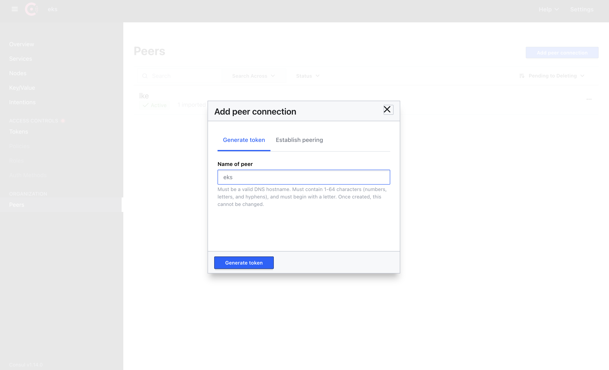
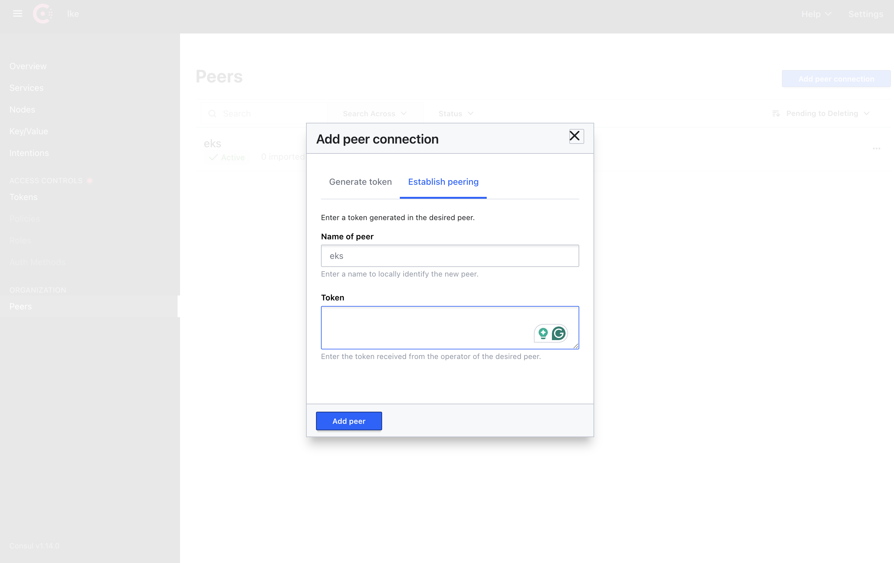
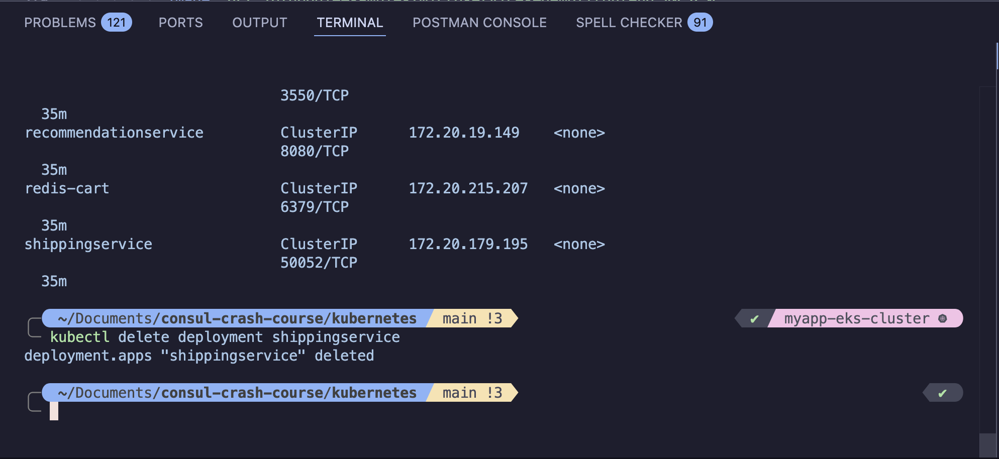
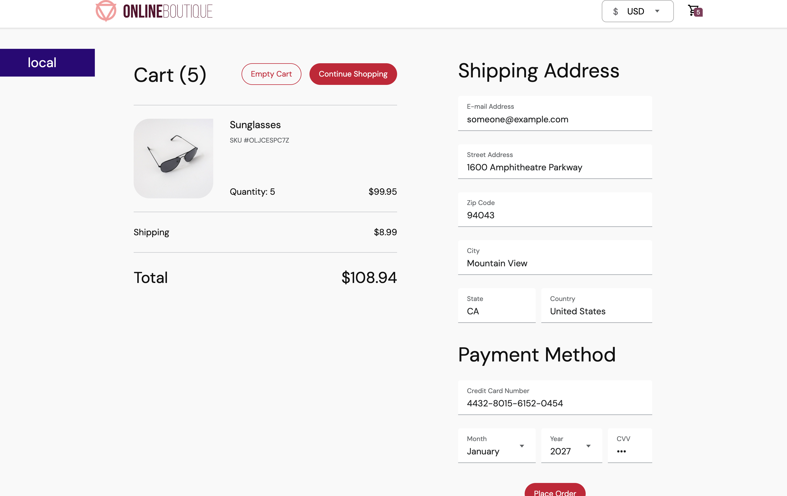

# Online Boutique + Consul Service Mesh (Multi-Cloud / Multi-Env)

This repo follows the workflow from TechWorld with Nana’s Consul crash course:

- Provision a Kubernetes cluster (EKS)
- Install Consul via Helm (Connect sidecars + UI)
- Deploy Online Boutique (Google’s microservices demo) using public container images
- (Multi-cluster) peer two Consul datacenters and test failover

Video reference: https://www.youtube.com/watch?v=s3I1kKKfjtQ

## Table of contents

- File structure
- Prerequisites
- Part 1 — EKS: provision with Terraform
- Part 2 — EKS: install Consul (Helm)
- Part 3 — EKS: deploy Online Boutique
- Part 4 — Access Consul UI + Web frontend
- Part 5 — Multi-cluster peering + failover
- Troubleshooting
- Screenshot checklist
- Cleanup
- Credits / attribution

## File structure

- `terraform/`
	- Terraform code to provision an AWS VPC + EKS cluster.
- `kubernetes/`
	- Kubernetes manifests for Online Boutique deployments.
	- Consul configuration/CRDs for mesh peering and failover.

Important files:

- `kubernetes/consul-values.yaml` – Helm values used to install Consul.
- `kubernetes/config-consul.yaml` – Online Boutique manifests with Consul annotations (Connect injection and upstreams).
- `kubernetes/consul-mesh-gateway.yaml` – Consul `Mesh` CRD settings for peering through mesh gateways.
- `kubernetes/exported-service.yaml` – Exports `shippingservice` to a peer.
- `kubernetes/service-resolver.yaml` – Failover policy for `shippingservice`.

## Prerequisites

### Accounts

- AWS account (for EKS)
- A second Kubernetes cluster (only required for the peering/failover part)

### Tools

- `terraform`
- `kubectl`
- `aws` (AWS CLI v2)
- `helm`

On macOS with Homebrew:

```sh
brew install terraform awscli kubectl helm
```

Verify:

```sh
terraform version
aws --version
kubectl version --client
helm version
```

## Part 1 — EKS: provision with Terraform (AWS)

### 1) Configure AWS credentials

You can either use:

- AWS CLI profiles (recommended):

```sh
aws configure
aws sts get-caller-identity
```

Or, if you want Terraform to use access keys directly:

1) Create an IAM user in AWS Console → IAM → Users → Create user
2) Attach permissions (for a demo, many people use `AdministratorAccess`)
3) Create an access key for “Command Line Interface (CLI)” use
4) Put the keys into `terraform/terraform.tfvars`

There’s an example file at `terraform/terraform.tfvars.example`.

```sh
cd terraform
cp terraform.tfvars.example terraform.tfvars
# edit terraform.tfvars and set aws_access_key_id/aws_secret_access_key
```

### 2) Run Terraform

From the `terraform/` directory:

```sh
terraform init
terraform apply -var-file terraform.tfvars
```

Notes:

- Region default is `ap-southeast-2` (see `terraform/variables.tf`).
- Kubernetes version is controlled by `k8s_version`.
	- EKS regularly drops support for older versions.
	- If you get `unsupported Kubernetes version`, update `k8s_version` in `terraform.tfvars` to a version supported by EKS in your region.
- Worker nodes are configured in `terraform/main.tf` (`instance_types`).

### 3) Update kubeconfig

```sh
aws eks update-kubeconfig --region ap-southeast-2 --name myapp-eks-cluster
kubectl get nodes
```

## Part 2 — EKS: install Consul on EKS (Helm)

### 1) Ensure EBS storage works (required for Consul server PVC)

Consul servers use a PersistentVolumeClaim. If your cluster has **no default StorageClass**, Consul server pods will stay `Pending` with:

> `pod has unbound immediate PersistentVolumeClaims`

Create a default `gp3` StorageClass (EKS EBS CSI driver must be installed):

```sh
kubectl get csidrivers | grep ebs.csi.aws.com

cat <<'EOF' | kubectl apply -f -
apiVersion: storage.k8s.io/v1
kind: StorageClass
metadata:
	name: gp3
	annotations:
		storageclass.kubernetes.io/is-default-class: "true"
provisioner: ebs.csi.aws.com
volumeBindingMode: WaitForFirstConsumer
parameters:
	type: gp3
EOF

kubectl get storageclass
```

### 2) Install/upgrade Consul

```sh
helm repo add hashicorp https://helm.releases.hashicorp.com
helm repo update

helm upgrade --install eks hashicorp/consul \
	--namespace default \
	--values kubernetes/consul-values.yaml \
	--set global.datacenter=eks
```

Wait until Consul pods are ready:

```sh
kubectl get pods -l app=consul
```

## Part 3 — EKS: deploy Online Boutique

```sh
kubectl apply -f kubernetes/config-consul.yaml
kubectl get pods
```

## Part 4 — Access Consul UI + Web frontend

### Online Boutique frontend

```sh
kubectl get svc frontend-external -o wide
```

Open the `EXTERNAL-IP` / hostname in your browser (HTTP on port 80).

### Consul UI

The Consul UI service is a LoadBalancer (HTTPS):

```sh
kubectl get svc -l app=consul,component=ui,release=eks -o wide
```

Open the LoadBalancer hostname using `https://...`.

## Part 5 — Multi-cluster peering + failover

This is the multi-cloud / multi-env part from the video: connect two Consul datacenters.

Assumptions:

- Cluster A: EKS (datacenter `eks`, Helm release `eks`)
- Cluster B: another Kubernetes cluster (example: Linode LKE) (datacenter `lke`, Helm release `lke`)

### 1) Install Consul in both clusters

Switch your `kubectl` context to cluster B, then install Consul there too (using the same values file but a different datacenter):

```sh
helm upgrade --install lke hashicorp/consul \
	--namespace default \
	--values kubernetes/consul-values.yaml \
	--set global.datacenter=lke
```

### 2) Enable peering through mesh gateways

Apply the `Mesh` CRD in both clusters:

```sh
kubectl apply -f kubernetes/consul-mesh-gateway.yaml
kubectl get mesh
```

Confirm the mesh gateway exists:

```sh
kubectl get pods -l app=consul,component=mesh-gateway
kubectl get svc  -l app=consul,component=mesh-gateway
```

If you don’t see a mesh gateway Service, list Consul services for the release:

```sh
kubectl get svc -l app=consul,release=lke -o wide
```

### 3) Establish the peering connection (via Consul UI)

In cluster A (EKS) Consul UI:

- Go to **Peering** → **Generate token**
- Peer name: `eks`
- Copy the token


In cluster B (LKE) Consul UI:

- Go to **Peering** → **Establish connection**
- Paste the token


Repeat the flow in the opposite direction if you want both peers configured explicitly.

### 4) Export `shippingservice` from cluster B and fail over from cluster A

On cluster B:

```sh
kubectl apply -f kubernetes/exported-service.yaml
```

On cluster A:

```sh
kubectl apply -f kubernetes/service-resolver.yaml
```

Test failover (cluster A):

```sh
kubectl delete deployment shippingservice
```

Then use the frontend UI to add items to the cart and proceed through checkout to verify `shippingservice` still responds (via the peer).


## Troubleshooting

### `aws: command not found` / `helm: command not found`

Install the missing tool:

```sh
brew install awscli helm
```

### EKS: `unsupported Kubernetes version`

Update `k8s_version` in `terraform/terraform.tfvars` to a version supported by EKS in your region and re-apply.

### Pods `Pending`: `Too many pods`

Your nodes hit the pod-per-node limit (AWS VPC CNI/IP limits).

- Scale up instance type (see `terraform/main.tf` → `instance_types`)
- Or increase node count

### Consul server `Pending`: `no storage class is set`

Create a default StorageClass (see “Ensure EBS storage works”) and recreate the stuck PVC.

### Consul UI load balancer returns `ERR_CONNECTION_CLOSED`

Usually means the Service has **no endpoints** (Consul server not running yet).

```sh
kubectl describe svc eks-consul-ui
kubectl get endpoints eks-consul-ui -o wide
```


## Cleanup

Uninstall Consul:

```sh
helm uninstall eks -n default
```

Destroy AWS resources:

```sh
cd terraform
terraform destroy -var-file terraform.tfvars
```

## Credits / attribution

- TechWorld with Nana – Consul crash course (concepts and workflow):
	- https://www.youtube.com/watch?v=s3I1kKKfjtQ
- GoogleCloudPlatform Online Boutique (“microservices-demo”) – container images and app design:
	- https://github.com/GoogleCloudPlatform/microservices-demo
- HashiCorp Consul Helm chart:
	- https://github.com/hashicorp/consul-k8s
